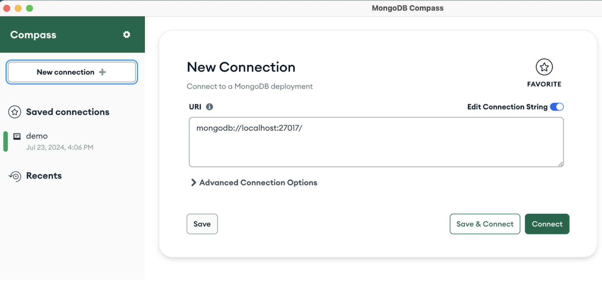
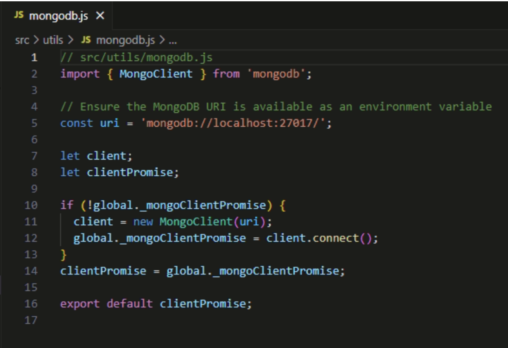

# Contoh Implementasi Sistem

Dalam penggunaan software GDE untuk tokenization, demonstrasi bisa dilihat dari hasil contoh implementasi dalam bentuk sistem website customer management sederhana. Berikut adalah panduan untuk melakukan demonstrasi tersebut.

## Prasyarat

Sebelum memulai, pastikan hal-hal berikut sudah terpenuhi:

1. **Install Java**: Proses instalasi Java Development Kit (JDK) dapat dibantu pada panduan [ini](https://www.geeksforgeeks.org/download-and-install-java-development-kit-jdk-on-windows-mac-and-linux/).
2. **Install NodeJS**: Proses instalasi NodeJS bisa dilakukan pada [situs resminya](https://nodejs.org/en).
3. **Setup CM, CTS, dan BDT** sesuai panduan ini.
4. **Install MongoDB dan MongoDB Compass**: Database yang digunakan pada demo adalah database on-premise sebagai simulasi database yang digunakan oleh perusahaan-perusahaan. Kali ini, database yang digunakan masih belum berupa database relational.

## 1. Setup Website

Contoh implementasi berupa sistem website customer management sederhana dapat dilihat dari repository GitHub berikut:

**Repository GitHub**: [SWGDemo-GDE-Tokenization-BDT](https://github.com/rhmn5ty/SWGDemo-GDE-Tokenization-BDT)

Berikut adalah langkah-langkah untuk memulai menjalankan website tersebut:

1. Buka repository tersebut dan download file `SWGDemo-GDE-Tokenization-BDT.zip` ke lokal komputer.
2. Di lokal komputer, extract file tersebut dan buka folder `SWGDemo-GDE-Tokenization-BDT`.
3. Buka command prompt atau terminal pada direktori folder tersebut.
4. Jalankan perintah: `npm install`
5. Jalankan perintah: `npm run dev` untuk menjalankan website.
6. Buka website pada port yang menjalankan website tersebut, biasanya `http://localhost:3000`.

## 2. Setup MongoDB

Dalam demonstrasi ini, database yang digunakan adalah database on-premise sebagai simulasi database yang digunakan oleh perusahaan-perusahaan. Database yang digunakan adalah MongoDB.

Pada MongoDB Compass, buat koneksi baru seperti berikut.

URI yang dipakai secara default dan pada kode program ini adalah `mongodb://localhost:27017/`. Jika port yang dipakai berbeda, pada kode program, buka file `SWGDemo-GDE-Tokenization-BDT/src/utils/mongodb.js` seperti pada gambar di bawah, lalu ubah isi variabel `uri`. Setelah ini, database sudah siap digunakan.

## 3. Cara Penggunaan

Setelah berhasil membuka website dan menghubungkan MongoDB, berikut adalah langkah-langkah penggunaannya:

1. Tekan tombol `Get Started` atau `Sign In` untuk memulai.
2. Lakukan sign-in untuk mencoba beberapa role berikut:

### Role dan Database

| Role     | Email              | Password |
| -------- | ------------------ | -------- |
| Database | database@gdemo.com | Gu@rd1um |
| Admin    | admin@gdemo.com    | Gu@rd1um |
| Customer | customer@gdemo.com | Gu@rd1um |
| HR       | hr@gdemo.com       | Gu@rd1um |
| Finance  | finance@gdemo.com  | Gu@rd1um |

### Hak Akses

- **Melihat Data NIK Customer**

  - Admin: Full Tokenized
  - Customer: Full Detokenized
  - HR: Full Masked
  - Finance: Full Detokenized
  - First 12 Digits: Masked, Last 4 Digits: Detokenized

- **Melihat Data Credit Card Customer**
  - Admin: Full Tokenized
  - Customer: Full Detokenized
  - HR: Full Masked
  - First 12 Digits: Masked, Last 4 Digits: Detokenized
  - Finance: Full Detokenized

Karena data pada database masih kosong, kita harus mengisikan data-data tersebut terlebih dahulu. Sebagai user role database atau admin, tekan tombol `Add New Customer`. Penambahan data customer dapat diisi satu per satu dan bisa juga diisi langsung dengan jumlah yang banyak dengan cara mengisi jumlahnya dan menekan tombol `Add Bulk Customers`. Selanjutnya, lakukan juga untuk data orders pada bagian `Add New Orders`. Data sudah bisa dilihat pada tampilan website sesuai dengan hak akses masing-masing role.
